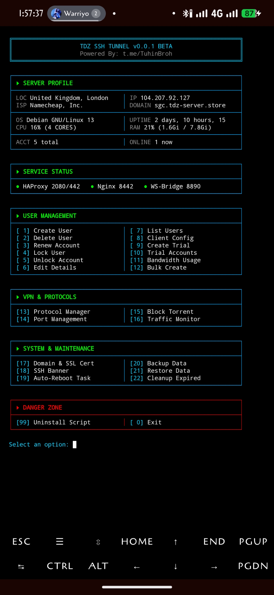
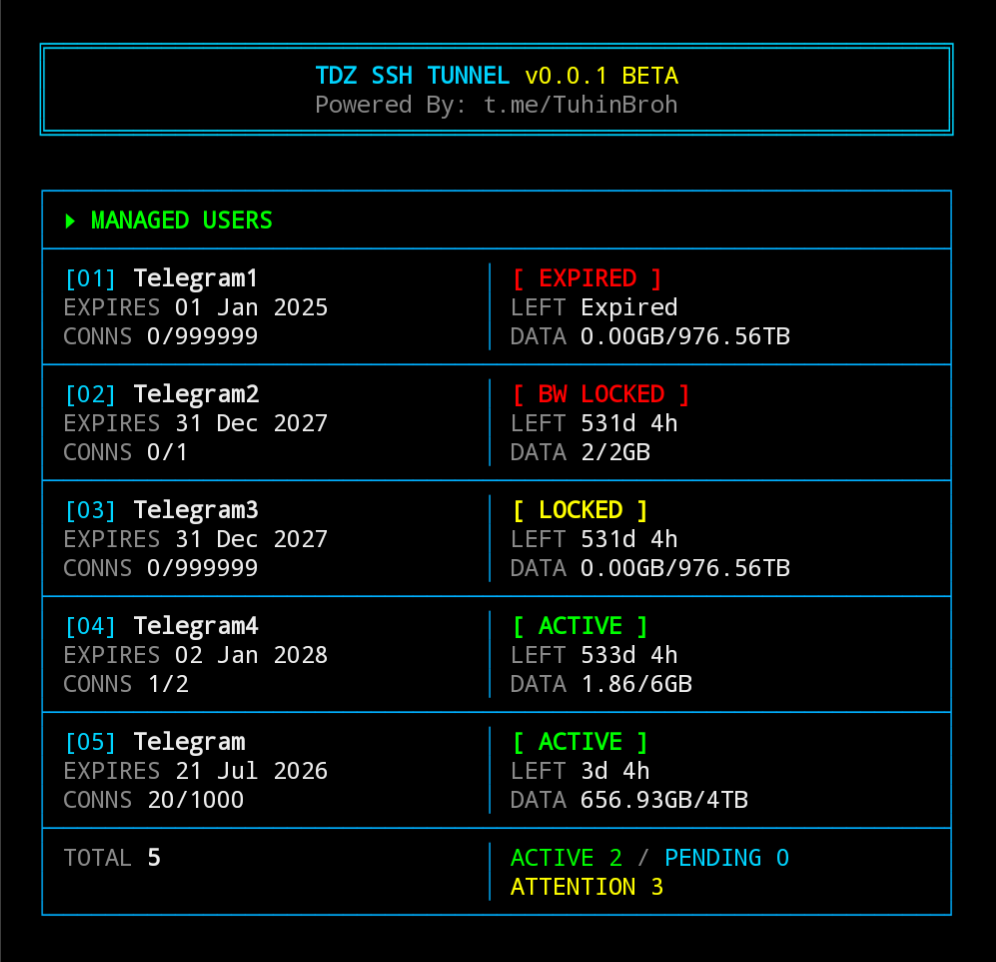
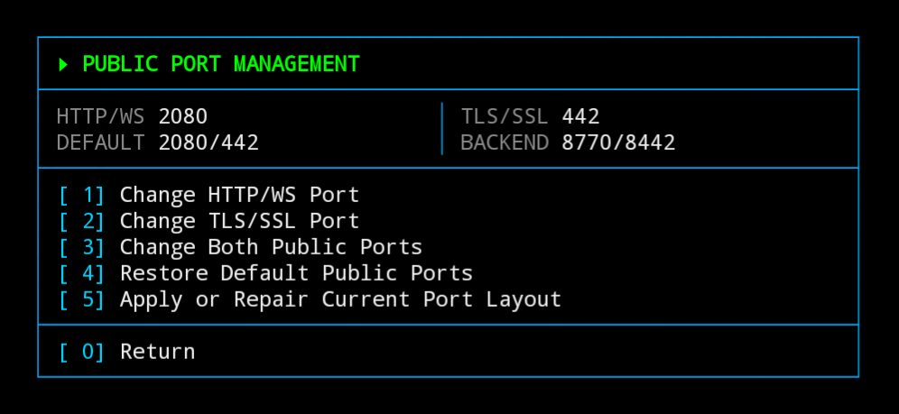
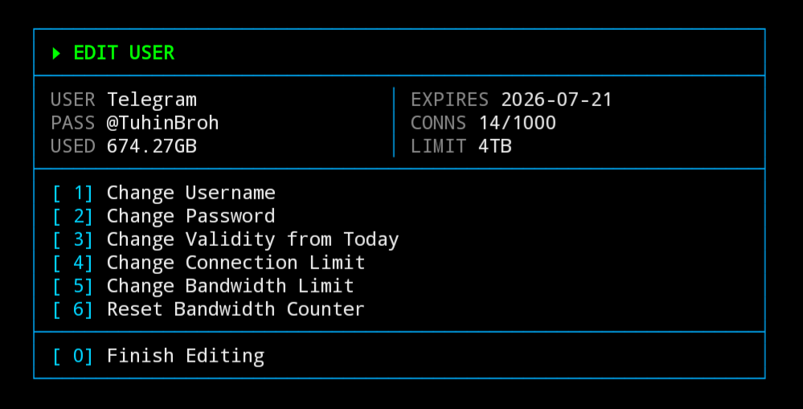
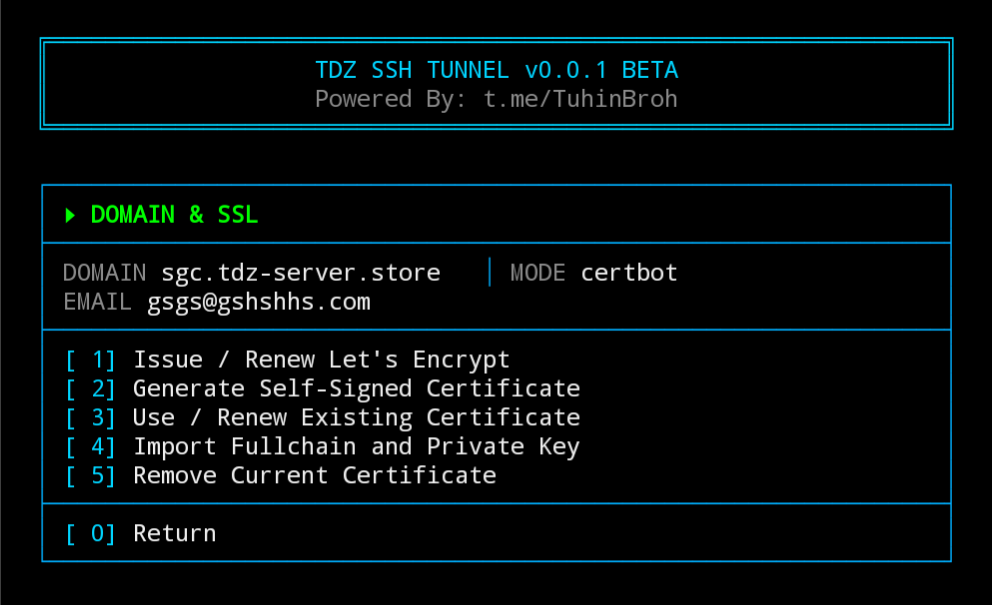
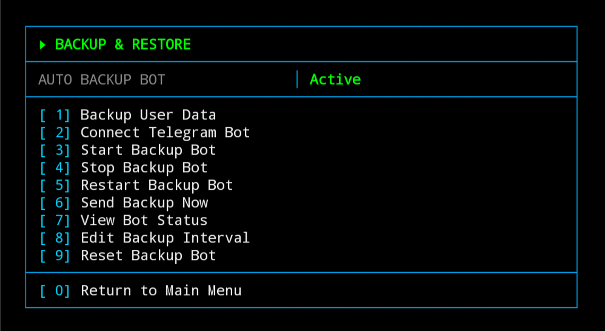
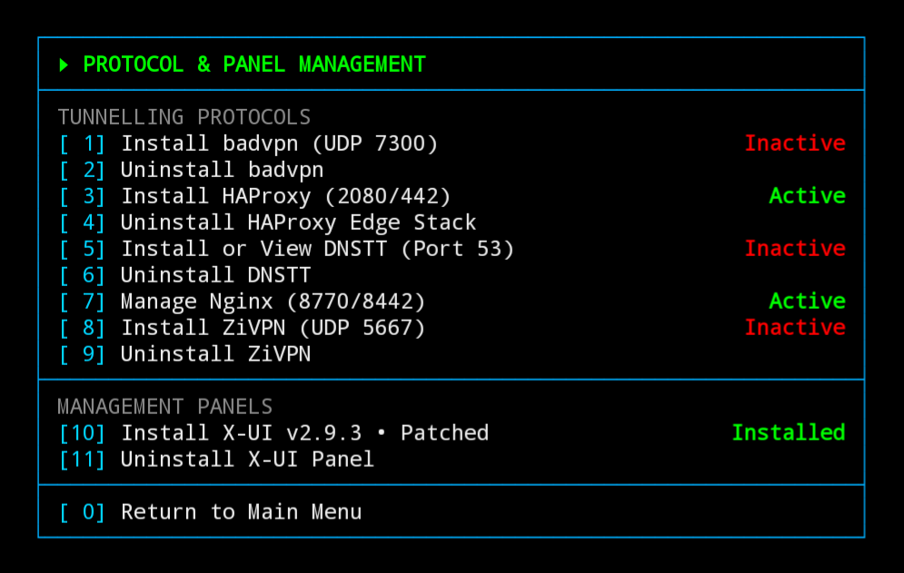
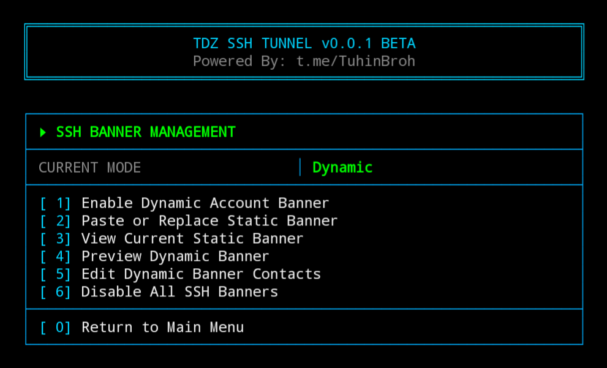

<p align="center">
  
  
  
  
</p>

<h1 align="center">TDZ SSH TUNNEL</h1>

<p align="center">
  <b>Advanced SSH Tunnel Management System for Linux VPS</b><br>
  Developed & maintained by <a href="https://tuhinbro.com"><b>Yeasinul Hoque Tuhin</b></a>
</p>

<p align="center">
  <a href="https://github.com/yeasinulhoquetuhin/TDZ-SSH-SCRIPT/stargazers"></a>
  <a href="https://github.com/yeasinulhoquetuhin/TDZ-SSH-SCRIPT/releases"></a>
  <a href="https://t.me/TuhinBroh"></a>
  <a href="https://t.me/TUSTDZ"></a>
</p>

---

## Overview

TDZ SSH TUNNEL is a comprehensive, bash-based SSH tunnel management system designed for Linux VPS servers. It provides a full-featured CLI dashboard for managing SSH tunnel users, monitoring bandwidth, controlling access, and deploying multiple tunnel protocols — all from a single interactive menu.

Built from scratch by **Yeasinul Hoque Tuhin**, this project represents a complete, ground-up implementation of a modern SSH tunnel management solution, independently developed with advanced features including dynamic HTML banners, per-user traffic accounting, multi-protocol support, and automated user lifecycle management.

---

## Screenshots

### Main Dashboard

<p align="center">
  
</p>

The live dashboard brings server information, service health, user management, protocols, maintenance tools, and the danger zone into one organized terminal interface.

### Managed Accounts

<p align="center">
  
</p>

Account status, expiration, remaining validity, active connections, and compact GB/TB traffic usage are displayed together for quick monitoring.

### Management Screens

<table>
  <tr>
    <td align="center" valign="top" width="50%">
      <br>
      <b>Public Ports</b>
    </td>
    <td align="center" valign="top" width="50%">
      <br>
      <b>Edit User</b>
    </td>
  </tr>
  <tr>
    <td align="center" valign="top" width="50%">
      <br>
      <b>Domain &amp; SSL</b>
    </td>
    <td align="center" valign="top" width="50%">
      <br>
      <b>Backup &amp; Restore</b>
    </td>
  </tr>
  <tr>
    <td align="center" valign="top" width="50%">
      <br>
      <b>Protocols &amp; Panels</b>
    </td>
    <td align="center" valign="top" width="50%">
      <br>
      <b>SSH Banners</b>
    </td>
  </tr>
</table>

---

## Features

### User Management
- **Create / Delete / Edit users** — full CRUD operations with safe username changes, password, expiry, session limit, and bandwidth controls
- **Bulk user creation** — generate multiple accounts at once with shared or individual settings
- **Start After First Use** — optionally keep a new or bulk-created account's validity paused until its first successful SSH connection; disabled by default. Editing a pending account changes its post-connection validity without starting the expiry clock
- **Trial accounts** — create 1h-to-72h auto-expiring demo users with automatic cleanup and a dedicated list for remaining time, usage, connections, and status
- **Account locking / unlocking** — manually lock or unlock any user account instantly
- **Account renewal** — extend expiry, adjust limits, or reset passwords for existing users
- **Expired user cleanup** — one-click removal of all expired accounts
- **User list with live status** — view all users with real-time online status, bandwidth usage, and remaining quota

### Bandwidth & Traffic
- **Per-user bandwidth tracking** — real-time I/O monitoring via `/proc/<pid>/io` with per-PID delta calculation
- **Data quotas** — set per-user bandwidth limits in GB; users exceeding quota are automatically locked
- **Live traffic monitor** — real-time dashboard showing per-user data consumption
- **Torrent blocking** — automatically block BitTorrent traffic per user

### Dynamic HTML Banners
- **Status-aware banners** — automatically shows different messages based on account state:
  - **Active** — account details with usage info
  - **Expired** — renewal prompt with contact link
  - **Traffic Ended** — data top-up prompt with contact link
  - **Locked** — unlock request message with contact link
- **DarkTunnel optimized** — HTML banners render perfectly in DarkTunnel and similar SSH client apps
- **Auto-updating** — banners refresh every second to reflect current session counts and bandwidth
- **Custom Admin & Channel usernames** — replace the default Telegram usernames with your own in the Dynamic Banner; matching `t.me/` links are generated automatically

### Tunnel Protocols
- **SSH (Direct)** — standard SSH tunnel on port 22
- **stunnel4 TLS** — TLS-wrapped SSH on port 2288 for firewall bypass
- **WebSocket NTLS** — non-TLS WebSocket payload on port 2289
- **BadVPN / UDPGW** — UDP game tunneling on port 7300
- **DNSTT** — DNS-based tunneling on port 5300
- **ZiVPN** — additional tunnel protocol support

### Network & Proxy
- **HAProxy** — reverse-proxy edge server on configurable public ports (defaults: 2080 HTTP, 442 HTTPS)
- **Nginx SSL termination** — internal proxy with shared TLS certificates
- **WS-to-SSH bridge** — DarkTunnel-compatible WebSocket bridge that accepts non-standard payloads and bridges to SSH
- **SSL/TLS certificates** — issue or renew Let's Encrypt certificates, generate self-signed certificates, reuse existing Certbot certificates, or import a custom fullchain and private key
- **Customizable public ports** — change the public HTTP/WS and TLS/SSL ports from the menu with validation and automatic rollback

### Branding & Customization
- **Rainbow ANSI banners** — colorful SSH login banners with per-character coloring
- **Premium CLI theme** — professional color-coded terminal interface with Navy + Cyan theme

### Backup & Recovery
- **Full user data backup** — archive all user configurations and data
- **Auto backup to Telegram** — scheduled automatic backups sent directly to your Telegram bot
- **Data restore** — restore user data from backup archives
- **Edge config backup** — backup HAProxy, Nginx, and SSL configurations

### System & Monitoring
- **Auto-reboot scheduler** — configure automatic VPS reboots at set intervals
- **Connection limit enforcement** — automatically kill excess SSH sessions beyond per-user limits
- **Service management** — start/stop/restart all TDZ services from the menu
- **X-UI panel integration** — optional X-UI panel installation for advanced proxy management

---

## Installation

**One-line install (as root):**

```bash
bash <(curl -Ls https://raw.githubusercontent.com/yeasinulhoquetuhin/TDZ-SSH-SCRIPT/master/install.sh)
```

**Manual install:**

```bash
curl -LO https://raw.githubusercontent.com/yeasinulhoquetuhin/TDZ-SSH-SCRIPT/master/install.sh
chmod +x install.sh
./install.sh
```

After installation, type **`menu`** to launch the management interface.

---

## SSL Certificate — Menu 17

Open **`menu → 17) Domain & SSL Cert`** to manage the shared certificate used by the TDZ edge stack.

| Option | Action |
|---|---|
| **1** | Issue a new Let's Encrypt certificate or renew one for a domain |
| **2** | Generate a self-signed certificate |
| **3** | List existing Certbot certificates with remaining validity, then apply an existing certificate or renew and apply it |
| **4** | Import a custom certificate by entering the paths to its `fullchain.pem` and matching `privkey.pem` |
| **5** | Remove the currently selected shared certificate |

For custom import, provide both files when prompted:

```text
Fullchain file path: /path/to/fullchain.pem
Private key file path: /path/to/privkey.pem
```

Before applying a certificate, TDZ verifies that the fullchain is valid and that its public key matches the private key. It then validates the active Nginx and HAProxy configuration. If validation or service restart fails, the previous working certificate is restored automatically.

---


## Default Ports

| Port | Protocol | Purpose |
|---|---|---|
| 22 | SSH | Primary SSH access |
| 2288 | TLS | stunnel4-wrapped SSH |
| 2289 | WS | WebSocket NTLS payload |
| 7300 | UDP | BadVPN / UDPGW |
| 5300 | DNS | DNSTT tunnel |
| 2080 | HTTP | HAProxy edge (HTTP, configurable default) |
| 442 | HTTPS | HAProxy edge (TLS, configurable default) |
| 8770 | HTTP | Nginx internal proxy |
| 8442 | HTTPS | Nginx internal TLS proxy |
| 8890 | TCP | WS-to-SSH bridge |

## Supported Platforms

TDZ SSH TUNNEL is designed for Debian-family VPS systems that use **APT** and **systemd**. It is not limited to only the versions shown in the old compatibility table.

| Distribution / family | Versions | Support level |
|---|---|---|
| **Ubuntu Server** | 18.04, 20.04, 22.04, 24.04 and newer releases | Compatible; current LTS releases are recommended |
| **Debian** | 10, 11, 12, 13 and newer releases | Compatible; current stable releases are recommended |
| **Kali Linux** | Current rolling releases | Compatible when running with systemd |
| **Linux Mint / LMDE** | Current Debian- or Ubuntu-based releases | Compatible when the required server packages are available |
| **Armbian** | Current Debian- or Ubuntu-based releases | Compatible; optional protocol availability depends on CPU architecture |
| **Other Debian/Ubuntu-based systems** | Current APT-based releases | Expected to work when Bash, OpenSSH, APT and systemd are available |

### CPU Architectures

| Architecture name | Common aliases | Support |
|---|---|---|
| **64-bit Intel/AMD** | `amd64`, `x86_64` | Full core support and the widest optional protocol support |
| **64-bit ARM** | `arm64`, `aarch64` | Full core support; most optional protocol components are available |
| **32-bit ARM** | `armv7l`, `armhf`, `arm` | Core management features can run; some prebuilt optional protocol components may be unavailable |

The installer automatically detects an existing installation, operating environment and CPU architecture. If a particular optional protocol has no binary for the detected CPU, only that component is skipped—the main TDZ menu, SSH user management, limits, banners, backup and restore features remain available.

> **Note:** Root access is required for installation and operation.

## Uninstall

```
menu → 99) Uninstall
```

Or directly:

```bash
bash /usr/local/bin/menu --uninstall
```

## Credits & License

- **Developer:** [Yeasinul Hoque Tuhin](https://tuhinbro.com)
- **Project:** TDZ SSH TUNNEL — independently developed from scratch
- **Third-party components:** BadVPN, DNSTT, stunnel4, HAProxy, Nginx, certbot (each retains its own license)

---

<p align="center">
  <b>TDZ SSH TUNNEL</b> — Developed with dedication by <a href="https://t.me/TuhinBroh"><b>Yeasinul Hoque Tuhin</b></a><br>
  <i>For support, contact <a href="https://t.me/Yeasinul_Hoque_Tuhin">ᴛᴜʜɪɴ • ʙʀᴏ</a> on Telegram</i>
</p>
